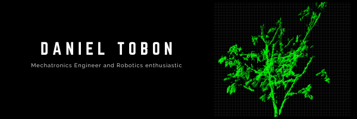

# Hi, I'm Daniel 👋
 

Mechatronics Engineer with an emphasis on Application Development in Robotics Perception Systems, Computer Vision techniques, and embedded systems. I am passionate about Computer Vision and Intelligent robotics perception systems, Mobile robotics, multi-robot cooperative systems, and Autonomous Vehicles. I enjoy sharing my work on GitHub with include some c++ applications, python frameworks and small projects about pointcloud processing, image processing, cmake frameworks, and embedded software. 

Find me on my networks:

- LinkedIn: https://www.linkedin.com/in/danieltobonco43/
- Portfolio: https://danieltobon43.github.io/

<!--
**danielTobon43/danielTobon43** is a ✨ _special_ ✨ repository because its `README.md` (this file) appears on your GitHub profile.

Here are some ideas to get you started:

- 🔭 I’m currently working on ...
- 🌱 I’m currently learning ...
- 👯 I’m looking to collaborate on ...
- 🤔 I’m looking for help with ...
- 💬 Ask me about ...
- 📫 How to reach me: ...
- 😄 Pronouns: ...
- ⚡ Fun fact: ...
-->
